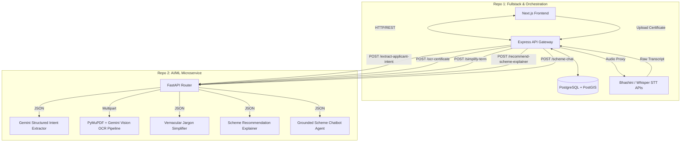

# AI-Driven Scheme Matching Platform
## AI/ML Services Specification

This repository contains the stateless AI/ML microservice for the Smart India Hackathon (SIH) Scheme Matching Platform. It is built using **FastAPI**, **Google Gemini 2.5 Flash** (supporting both native `google-genai` SDK and `openai` SDK for OpenRouter), and **Pydantic v2**, containerized with Docker, and deployed on **Render**.

It acts as an auxiliary intelligence processor for Repo 1 (Fullstack & Orchestration), which enforces all deterministic business rules, user authentication, PostgreSQL database state, and geographic routing queries.

---

## 1. Architectural Scope & Decoupling

Repo 2 is designed to be **completely stateless** and **database-free**. It does not perform database reads/writes or enforce hard qualification criteria. Its responsibilities are strictly bound to interpreting unstructured inputs (speech transcriptions and scanned certificates) and generating natural language outputs (jargon simplification, recommendation explanations, and grounded Q&A advice).

### Architectural Boundary Model



### Core Separation of Concerns

| Feature | Repo 1 (Fullstack) | Repo 2 (AI / ML) |
| :--- | :--- | :--- |
| **Eligibility Verification** | Enforces hard filters (Caste, Income, Age, Trade) via deterministic PostgreSQL queries. | *None.* |
| **Ranking & Scoring** | Computes Branch Score based on proximity (PostGIS) and branch health (NPA, Quotas). | *None.* |
| **Entity Extraction** | Captures audio/text and acts as a gateway proxy. | Extracts parameters from raw voice transcriptions into structured JSON via Gemini (`/extract-applicant-intent`). |
| **Document Processing** | Stores documents, manages metadata, and generates PDF dossiers. | Renders PDFs/Images via PyMuPDF/Pillow and parses structured fields via Gemini Multimodal Vision (`/ocr-certificate`). |
| **Natural Language** | Serves static UI translations. | Generates contextual, localized explanations of terminology and scheme fit (`/simplify-term`, `/recommend-scheme-explainer`). |
| **Scheme Advisory Chat** | Manages conversation state, stores chat transcripts, and proxies user messages. | Runs two-tier hybrid RAG (70+ Grounded Policy Truth Base + General Banking & Procedural Fallback) with proactive suggested questions (`/scheme-chat`). |

---

## 2. Technology Stack & Key Dependencies

* **Web Framework**: FastAPI `>=0.115.0` (Asynchronous request handling, automated OpenAPI documentation generation)
* **LLM Engine**: Google Gemini 2.5 Flash
  - Primary SDK: `google-genai` `>=1.0.0`
  - Fallback SDK: `openai` `>=1.50.0` (for OpenRouter compatibility)
* **Document & Image Processing**: 
  - `pymupdf` `>=1.24.0` (`fitz`) for PDF-to-image 300 DPI rendering
  - `pillow` `>=10.0.0` (`PIL`) for image validation and pre-processing
* **Data Validation**: `pydantic` `>=2.0.0` (Strict request/response validation and native JSON Schema enforcement)
* **Testing Framework**: `pytest` `>=8.0.0`, `httpx` `>=0.27.0` (45 automated test suites covering all routes, services, edge cases, error handlers, and mock fallbacks)
* **Server**: Uvicorn (High-performance ASGI server)
* **Containerization**: Docker (Python 3.11-slim base)

---

## 3. Directory Layout

```text
SIH-26-AI-ML/
├── API_CONTRACTS.md           # Detailed JSON payloads and verification rules
├── PIPELINES.md               # LLM prompts, structured outputs, and OCR logic
├── AI_ML_SPECIFICATION.md     # Architecture specifications and system boundaries
├── Dockerfile                 # Render / Container deployment configuration
├── README.md                  # Quickstart and integration guide
├── requirements.txt           # Python dependencies
├── .env.example               # Example environment variables configuration
├── main.py                    # FastAPI application entrypoint & global exception handlers
├── app/
│   ├── __init__.py
│   ├── config.py              # Settings loader supporting GEMINI_API_KEY & OPENROUTER_API_KEY
│   ├── models/
│   │   ├── __init__.py
│   │   └── schemas.py         # Pydantic request & response schemas
│   ├── resources/
│   │   └── schemes_knowledge.txt # Consolidated scheme facts & policy guidelines (75 sections)
│   ├── routes/
│   │   ├── __init__.py
│   │   ├── intent.py          # Route: /extract-applicant-intent
│   │   ├── ocr.py             # Route: /ocr-certificate
│   │   ├── jargon.py          # Route: /simplify-term
│   │   ├── explainer.py       # Route: /recommend-scheme-explainer
│   │   └── chat.py            # Route: /scheme-chat
│   └── services/
│       ├── __init__.py
│       ├── gemini_service.py  # Google Gemini SDK caller, prompts, tools, and RAG loader
│       └── ocr_service.py      # PyMuPDF + Gemini Multimodal Vision document parser
└── tests/
    ├── conftest.py            # Pytest configuration & environment mocks
    ├── test_chat.py           # Unit tests for /scheme-chat & RAG pipeline
    ├── test_explainer.py      # Unit tests for /recommend-scheme-explainer
    ├── test_intent.py         # Unit tests for /extract-applicant-intent
    ├── test_jargon.py         # Unit tests for /simplify-term
    └── test_ocr.py            # Unit tests for /ocr-certificate
```

---

## 4. Setup & Running Locally

### Prerequisites
* Python 3.10 or 3.11
* Google Gemini API Key (or OpenRouter API Key)

### Installation
1. Clone the repository:
   ```bash
   git clone https://github.com/aviraltrip/SIH-26-AI-ML.git
   cd SIH-26-AI-ML
   ```
2. Set up virtual environment:
   ```bash
   python -m venv venv
   # On Windows:
   .\venv\Scripts\activate
   # On Linux/macOS:
   source venv/bin/activate
   ```
3. Install dependencies:
   ```bash
   pip install -r requirements.txt
   ```
4. Configure `.env`:
   ```env
   GEMINI_API_KEY=your_gemini_api_key_here
   GEMINI_MODEL=gemini-2.5-flash
   PORT=8000
   ```

### Running Tests
```bash
python -m pytest
```

### Running the Server
```bash
uvicorn main:app --host 0.0.0.0 --port 8000 --reload
```
Interactive Swagger Documentation: `http://localhost:8000/docs`

---

## 5. Deployment Guide (Render)

This microservice runs as a Docker Web Service on Render:
1. Set the **Environment Variables** in Render Dashboard:
   - `GEMINI_API_KEY`: Google Gemini API Key (or `OPENROUTER_API_KEY`)
   - `GEMINI_MODEL`: `gemini-2.5-flash`
2. Render uses `Dockerfile` to build the Python 3.11-slim container.
3. Configure a heartbeat ping on `/health` every 10 minutes to prevent free-tier container spin-down.

---

## 6. Reference Guides

* [API_CONTRACTS.md](file:///c:/Users/avira/SIH-26-AI-ML/API_CONTRACTS.md) — Endpoint shapes, sample payloads, and status codes.
* [PIPELINES.md](file:///c:/Users/avira/SIH-26-AI-ML/PIPELINES.md) — System prompts, multimodal OCR heuristics, and RAG knowledge architecture.
* [README.md](file:///c:/Users/avira/SIH-26-AI-ML/README.md) — Quickstart and fullstack integration snippets.
