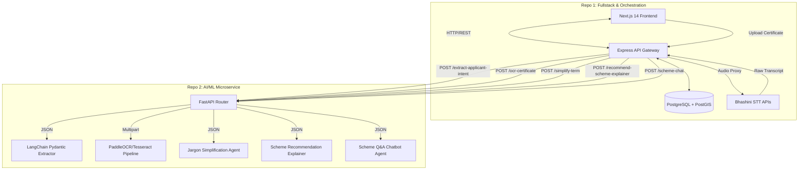

# AI-Driven Scheme Matching Platform
## AI/ML Services Specification

This repository contains the stateless AI/ML microservices for the Smart India Hackathon (SIH) project. It is built using **FastAPI** and deployed on **Render (as a Docker Web Service)**. It acts as an auxiliary processor for Repo 1 (Fullstack & Orchestration), which enforces all deterministic rules, user roles, database state, and geo-routing queries.

---

## 1. Architectural Scope & Decoupling

Repo 2 is designed to be **completely stateless** and **database-free**. It does not perform database reads/writes or enforce core qualification logic. Its responsibilities are strictly bound to interpreting unstructured inputs (speech transcriptions and document scans) and generating natural language outputs (jargon simplification and recommendation explanations).

### Architectural Boundary Model



### Core Separation of Concerns

| Feature | Repo 1 (Fullstack) | Repo 2 (AI / ML) |
| :--- | :--- | :--- |
| **Eligibility Verification** | Enforces hard filters (Caste, Income, Age, Trade) via deterministic PostgreSQL queries. | *None.* |
| **Ranking & Scoring** | Computes Branch Score based on proximity (PostGIS) and branch health (NPA, Quotas). | *None.* |
| **Entity Extraction** | Captures audio/text and acts as a gateway proxy. | Extracts parameters from raw voice transcriptions into structured JSON. |
| **Document Processing** | Stores documents, manages metadata, and generates PDF dossiers. | Performs optical character recognition (OCR) and parses fields. |
| **Natural Language** | Serves static translation/localization. | Generates contextual, localized explanations of terminology and scheme fit. |
| **Scheme Advisory Chat** | Manages conversation state, stores chat transcripts, and proxies user messages. | Runs retrieval-augmented generation (RAG) using consolidated policy guidelines. |

---

## 2. Technology Stack

*   **Framework**: FastAPI (Asynchronous request handling, automated OpenAPI documentation generation)
*   **LLM Orchestration**: LangChain (Structured output extraction, prompt templating, chain orchestration)
*   **Document OCR**: PaddleOCR (High accuracy for structured Hindi/English document layouts) / Tesseract OCR (Fallback engine)
*   **Data Validation**: Pydantic v2 (Strict request/response validation and schema parsing)
*   **Server**: Uvicorn (ASGI web server implementation)
*   **Deployment**: Docker Web Service on **Render** (listens on environment-defined `$PORT`)

---

## 3. Directory Layout

The repository is structured to separate API routes, processing pipelines, and deployment configs:

```text
SIH-26-AI-ML/
├── API_CONTRACTS.md           # Detailed JSON payloads and verification rules
├── PIPELINES.md               # LLM prompts and OCR extraction logic
├── Dockerfile                  # Render deployment container config (Docker Web Service)
├── README.md                   # Quickstart instructions
├── requirements.txt            # Python dependencies
├── main.py                     # FastAPI application entrypoint
├── app/
│   ├── __init__.py
│   ├── config.py               # Environment variables & API keys
│   ├── models/
│   │   ├── __init__.py
│   │   └── schemas.py          # Pydantic request/response schemas
│   ├── resources/
│   │   └── schemes_knowledge.txt # Consolidated scheme facts & guidelines
│   ├── routes/
│   │   ├── __init__.py
│   │   ├── intent.py           # Route: /extract-applicant-intent
│   │   ├── ocr.py              # Route: /ocr-certificate
│   │   ├── jargon.py           # Route: /simplify-term
│   │   ├── explainer.py        # Route: /recommend-scheme-explainer
│   │   └── chat.py             # Route: /scheme-chat
│   └── services/
│       ├── __init__.py
│       ├── langchain_service.py # LangChain wrappers and prompt configs
│       └── ocr_service.py       # PaddleOCR/Tesseract processing pipeline
```

---

## 4. Setup & Running Locally

### Prerequisites
*   Python 3.10 or 3.11
*   Tesseract OCR binary installed on host system (if using Tesseract fallback)

### Installation
1.  Clone the repository and navigate to the directory:
    ```bash
    cd SIH-26-AI-ML
    ```
2.  Create and activate a virtual environment:
    ```bash
    python -m venv venv
    # On Windows:
    .\venv\Scripts\activate
    # On macOS/Linux:
    source venv/bin/activate
    ```
3.  Install dependencies:
    ```bash
    pip install -r requirements.txt
    ```

### Running the API Server
Start the local development server using Uvicorn:
```bash
uvicorn main:app --host 0.0.0.0 --port 8000 --reload
```
Once running, the interactive API documentation is available at `http://localhost:8000/docs`.

---

## 5. Deployment Guide (Render)

This microservice runs as a Docker Web Service on Render. Since Render's free tier spins down the container after 15 minutes of inactivity, configuring a cron job or external uptime checker (e.g., UptimeRobot pinging the `/health` endpoint every 10–12 minutes) is recommended to prevent cold starts during evaluation.

### Dockerfile Requirements
The `Dockerfile` must:
1.  Use a lightweight Python base image (e.g., `python:3.10-slim`).
2.  Install system dependencies required for OpenCV and OCR (e.g., `libgl1-mesa-glx`, `tesseract-ocr`, `tesseract-ocr-hin` for Hindi).
3.  Expose the port dynamically supplied by Render via the `PORT` environment variable.
4.  Run Uvicorn binding to host `0.0.0.0` and bind to the dynamic `PORT` using shell execution:
    ```dockerfile
    CMD uvicorn main:app --host 0.0.0.0 --port $PORT
    ```

---

## 6. Detailed Reference Guides

For in-depth implementations and configurations, refer to:
*   [API_CONTRACTS.md](file:///c:/Users/avira/SIH-26-AI-ML/API_CONTRACTS.md) - Exact input/output shapes, validation logic, and HTTP status codes.
*   [PIPELINES.md](file:///c:/Users/avira/SIH-26-AI-ML/PIPELINES.md) - Core engine internals, including LangChain templates, prompts, and OCR parsing heuristics.
