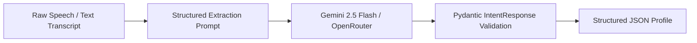
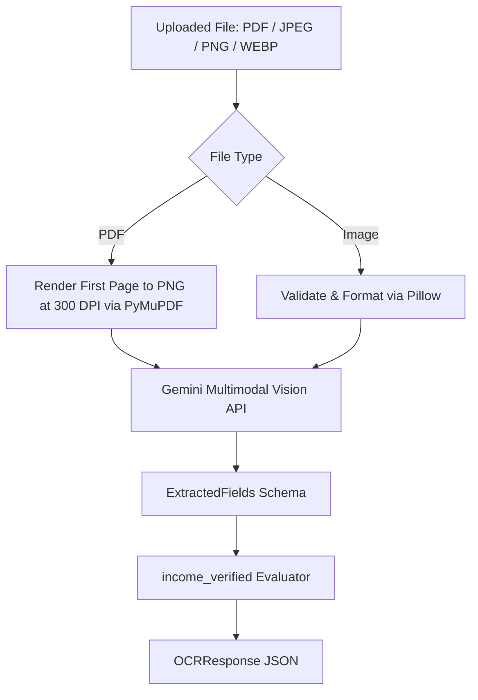
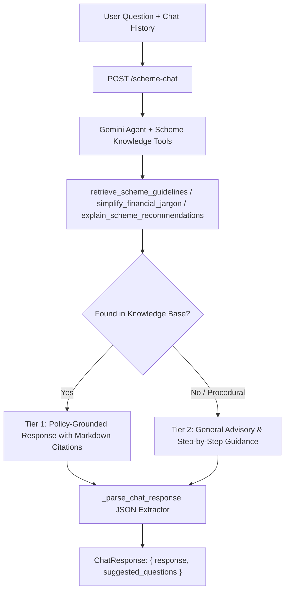

# Pipeline Architectures & Prompts

This document outlines the internal execution pipelines, Google Gemini LLM prompts, structured schema enforcement, multimodal computer vision routines, and two-tier hybrid RAG architecture running within the AI/ML microservice.

---

## 1. Structured Applicant Intent & Entity Extraction

Takes raw speech-to-text transcriptions or conversational text statements (in Hindi, English, or regional languages) and extracts a structured applicant profile adhering to `IntentResponse`.

### Execution Flow



### System Prompt Template (`SYSTEM_PROMPT_INTENT`)

```text
You are an expert financial counselor specializing in government social schemes.
Your task is to analyze the unstructured user transcription text and extract the applicant's profile details.

Extract the following variables:
1. project_category: Must strictly be one of ["Manufacturing", "Service", "Trading"]
2. requested_amount: Extract numeric loan amount in INR. Default to 0.0 if not mentioned.
3. annual_income: Extract numeric annual family income in INR. Default to 0.0 if not mentioned.
4. trade: Extract specific trade/occupation in English (e.g., Kirana, Tailoring, Barber, Welding, Dairy).
5. gender: Extrapolate or extract gender (e.g., "Male", "Female", "Other"). Default to "Male" if unknown.
6. confidence: Provide a confidence score between 0.0 and 1.0 for the overall extraction accuracy.

Rules:
- If the input transcription is in an Indian regional language (e.g., Hindi, Marathi, Tamil), translate the trade, project category, and gender values to English in the structured output.
- Ensure requested_amount and annual_income are non-negative numeric floats.
```

### Implementation Highlights (`app/services/gemini_service.py`)

* **Google GenAI SDK**: Uses `client.models.generate_content` with `response_mime_type="application/json"` and `response_schema=IntentResponse`.
* **OpenRouter Fallback**: Uses `client.chat.completions.create` with `response_format={"type": "json_object"}` and Pydantic model validation.
* **Temperature**: Low (`0.1`) for strict deterministic parameter extraction.

---

## 2. Multimodal OCR Certificate Processing Pipeline

Extracts applicant information from uploaded certificates (Caste or Income) to verify eligibility using PyMuPDF (rendering PDF pages at 300 DPI) and Gemini Multimodal Vision API.

### Preprocessing & Multimodal Flow



### OCR System Prompt Template (`OCR_SYSTEM_PROMPT`)

```text
You are an expert government document auditor specializing in verifying caste and income certificates.
Your task is to analyze the attached document image and extract the applicant's profile details.

Extract the following fields:
1. name: The full name of the applicant printed on the document. Do not include titles like 'Shri', 'Smt', 'Kumari', etc. unless they are part of the name.
2. category: The caste category (must strictly be one of ['SC', 'ST', 'OBC', 'EWS', 'General']) if this is a Caste Certificate. If the document is an Income Certificate, set this to null.
3. annual_income: The total annual family income in INR as a float value if this is an Income Certificate. If the document is a Caste Certificate, set this to null.
4. valid_until: The expiration date of the document in YYYY-MM-DD format (if printed). If not mentioned or if the document is permanent, set this to null.

Rules:
1. If the input document is in an Indian regional language (e.g., Hindi, Marathi, Tamil, etc.), translate the name, category, and date values to English in the structured output.
2. Be extremely precise. Double check numbers and decimal points.
3. Strict adherence to output JSON schema format is mandatory.
```

### Deterministic Income Verification Rule

```python
def is_income_verified(doc_type: str, annual_income: Optional[float]) -> bool:
    """Verifies that an income certificate is <= ₹5,00,000 threshold."""
    if doc_type == "income" and annual_income is not None:
        return annual_income <= 500000.00
    return False
```

---

## 3. Multilingual Jargon Simplification

Translates dry banking and policy terminology (e.g. *Moratorium*, *Collateral*, *Promoter Margin*, *Working Capital*, *Debt-Equity Ratio*) into conversational regional language explanations using intuitive everyday analogies.

### Supported Language Mappings
Supports 12+ Indian regional languages: English (`en`), Hindi (`hi`), Marathi (`mr`), Tamil (`ta`), Telugu (`te`), Bengali (`bn`), Gujarati (`gu`), Kannada (`kn`), Punjabi (`pa`), Malayalam (`ml`), Odia (`or`), Urdu (`ur`).

### System Prompt Template (`SYSTEM_PROMPT_TEMPLATE`)

```text
You are a local community helper explaining banking and government-scheme terms to rural micro-entrepreneurs.
Explain the financial jargon term clearly in simple, colloquial, conversational style using the requested target language.
Avoid technical sub-jargon. Use real-life analogies (for example, compare 'moratorium' to a 'crop growing period before harvest' or a 'holiday from payment', or 'collateral' to a 'security item or guarantee pledged for a loan').
Keep the response within 2-3 sentences.
Rules:
1. Preserve the correct meaning of the financial term.
2. Do not invent policy rules, eligibility conditions, interest rates, or benefits.
3. Do not provide financial or legal advice.
4. Do not use complex vocabulary or dictionary-style definitions.
5. Prefer natural, conversational tone in the requested language.
6. Do NOT include preambles (such as 'Here is the explanation:'), headings, markdown bolding/formatting, or bullet points.
7. Return ONLY the plain explanation text.
```

---

## 4. Recommendation Narrative Explainer

Generates a tailored narrative explaining why the top shortlisted scheme fits the applicant's profile and providing a brief comparison with runner-up options.

### System Prompt Template (`SYSTEM_PROMPT_EXPLAINER`)

```text
You are an expert government financial advisor assisting micro-entrepreneurs and artisans.
Your task is to analyze an applicant's profile and a list of candidate government loan/subsidy schemes, and produce a structured, localized recommendation explanation.

Rules:
1. 'top_scheme': The exact scheme_name of the best-matching scheme.
2. 'explanation': 2-3 clear, conversational sentences in the target language explaining WHY this scheme fits the applicant's profile best. Highlight favorable terms like lower interest rates, high coverage percentage, gender-specific benefits, or trade alignment.
3. 'runner_up_note': 1-2 sentences in the target language explaining how other candidate schemes compare and why they ranked lower.
4. If candidate_schemes has only 1 scheme, acknowledge that it is the primary eligible option.
5. All text in 'explanation' and 'runner_up_note' MUST be in the requested target language.
```

---

## 5. Scheme Q&A Chatbot (Two-Tier Grounded RAG & Proactive Suggestions)

Provides grounded, multi-turn conversational advisory based on consolidated government policy guidelines loaded from `app/resources/schemes_knowledge.txt`, coupled with a resilient two-tier hybrid fallback that answers general banking and procedural questions without dead-ending the user.

### Execution Flow



### Knowledge Base Content Coverage (`app/resources/schemes_knowledge.txt`)
* **Schemes (1 to 70)**: NBCFDC (MSY, MCS, New Swarnima, Mahila Kisan Yojana), PM Vishwakarma, PMEGP, Mudra (Shishu, Kishor, Tarun), Stand-Up India, SVANidhi, NHFDC, NMDFC, ELAS, and State-level concessional credit schemes.
* **Procedural Guidelines (71 to 75)**:
  - **Section 71**: General Loan Application Procedures, CSC Workflows, and Jan Samarth Guidelines.
  - **Section 72**: Universal Document Checklist and Paperwork Requirements.
  - **Section 73**: Loan Disbursement, Moratorium Mechanics, and Subsidy Release Process.
  - **Section 74**: Grievance Redressal, Nodal Officers, and Lead District Managers (LDM).
  - **Section 75**: Cross-Scheme Eligibility, One Beneficiary per Family Norms, and Common FAQs.

### Output JSON Format Specification

The model formats its output as structured JSON:
```json
{
  "response": "Grounded answer text in the requested target language with citations or general procedural steps.",
  "suggested_questions": [
    "Contextual follow-up question 1 in target language",
    "Contextual follow-up question 2 in target language",
    "Contextual follow-up question 3 in target language"
  ]
}
```

---

## 6. Security & Secret Redaction

To prevent sensitive API keys or credentials from leaking into log aggregators (e.g., Render, Datadog), all service callers pass error messages and payload dumps through `_redact_secrets()`:
- Redacts Google API keys (`AIza...`, `AQ...`)
- Redacts OpenRouter API keys (`sk-or-...`)
- Redacts HTTP Authorization Bearer tokens (`Bearer ...`)
